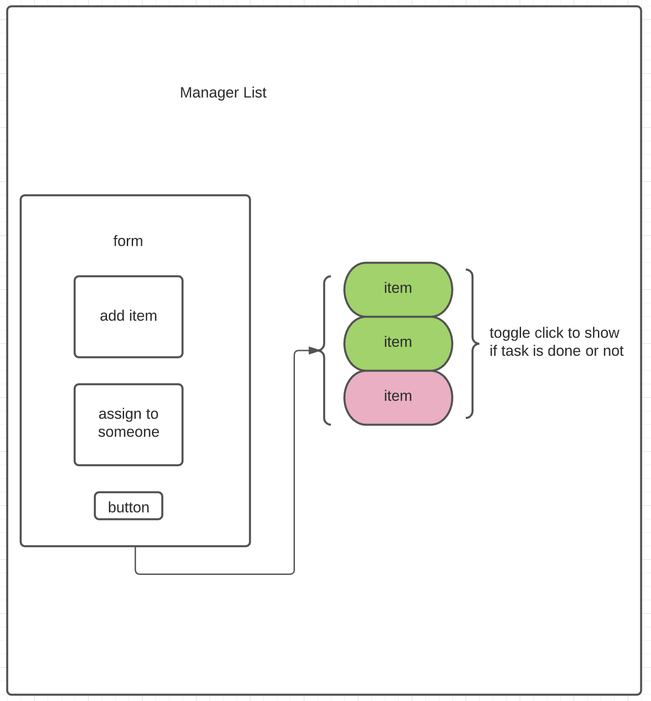

# TODO 

## Start the App
- Clone api-server-todo 
    - https://github.com/luluse/api-server-todo
    - add .env file with PORT and MONGODB_URI
- run npm start on Todo React app

## Phase 1: 

- As a user, I would like an easy way to add a new to do item using an online interface
- As a user, I would like my to do items to have an assignee, due date, difficulty meter, status and the task itself
- As a user, I would like to delete to do items that are no longer needed
- As a user, I would like to easily mark to do items as completed
- As a user, I would like to edit an existing to do item

## Phase 2: 
- As a user, I would like to be able to add, update, and delete To Do items
- As a user, I would like my To Do Items to be permanently stored so that I can re-access them at any time, using any device

## UML
